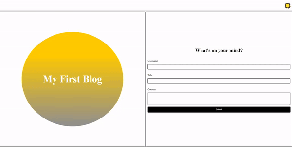

# Xydra's Personal Blog (Challenge 04)

## Description

This app acts as a rudimentary blog page and I made it in order to practice my skills with HTML, CSS, and Javascript all at the same time. The app starts out on a landing page where the user has the option to fill out a form with different piece of information. After submission the user is taken to another page where all thier previous "posts" are displayed on the page with the option to go back and add as many entries as they'd like. The posts are saved as info in localStorage and so are persistant even if the page is reloaded. This site makes for a good template for future projects of similar nature and also taught me how to do stuff on a webpage that I hardly thought to think about how it worked. Like how to switch a page betwee light and dark modes.

## Usage

This app can be used as a personal blog, diary, or as a tool to learn how to code. Looking under the hood you can see many examples of features and code that you can add to your own projects and get an idea of how to make a blog yourself. Besides that its a nice app to have even just to play around with.

## License

Refer to README.MD in Repository.

---
